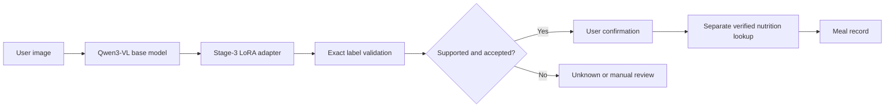
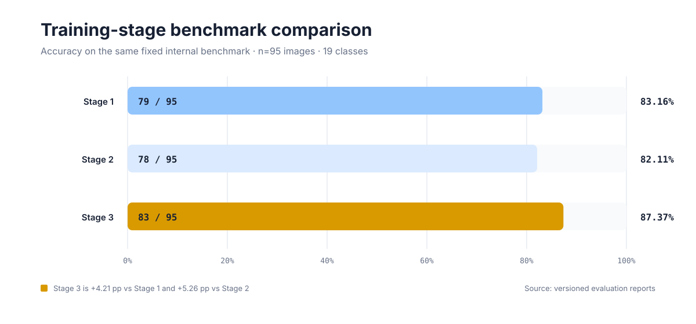
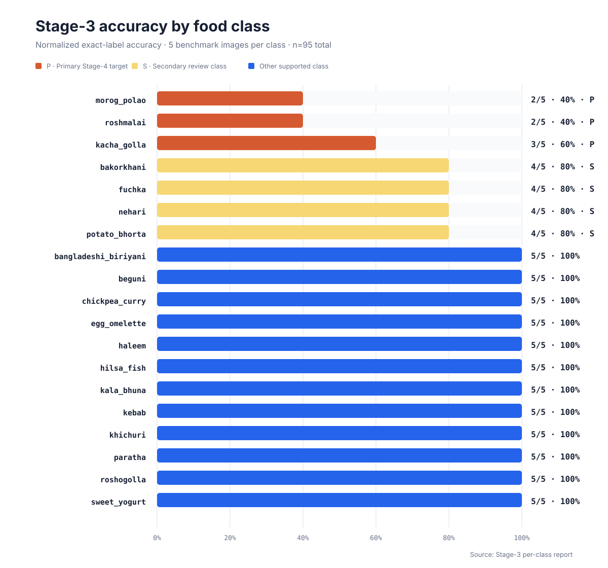
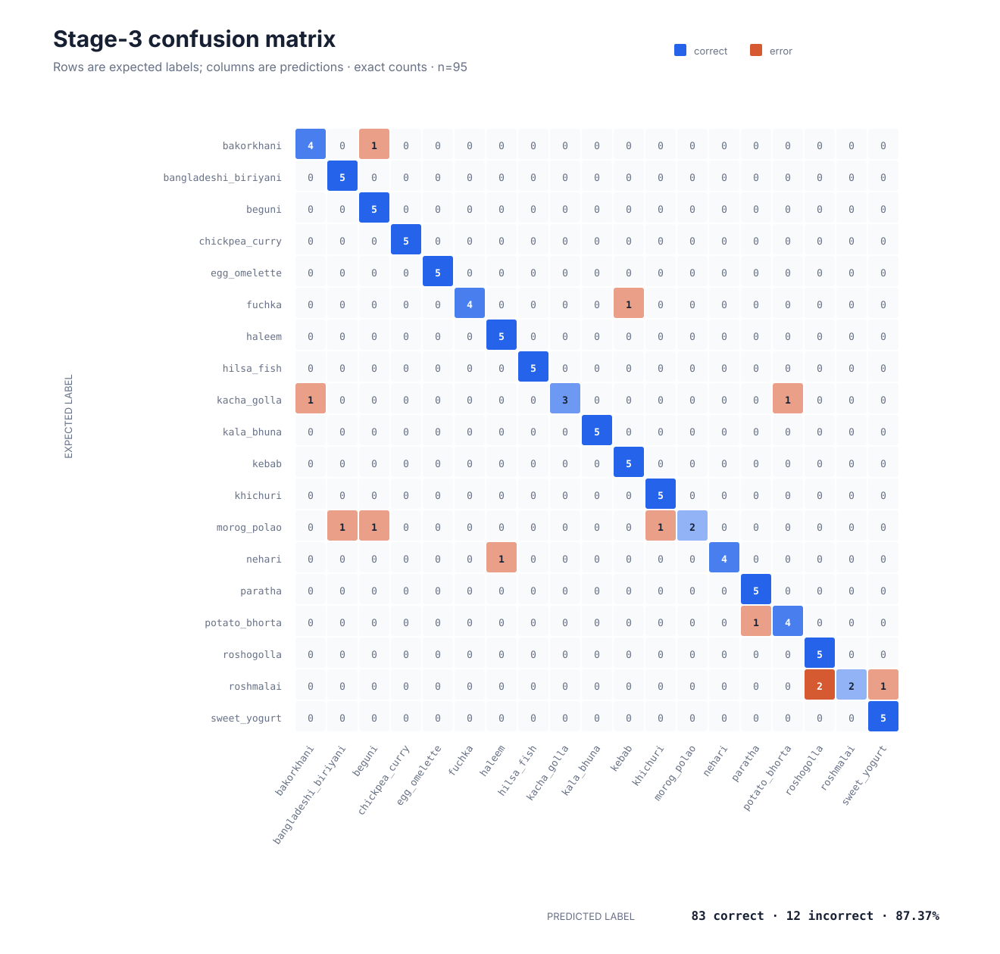

# Deshi Digest Vision Model

The Deshi Digest Vision Model is a LoRA adapter for
[`Qwen/Qwen3-VL-2B-Instruct`](https://huggingface.co/Qwen/Qwen3-VL-2B-Instruct),
developed to recognize a controlled vocabulary of 19 Bangladeshi and Bengali
foods from images. It was trained with MS-SWIFT in Kaggle Notebooks using two
NVIDIA T4 GPUs. The current best checkpoint is Stage 3 `checkpoint-348`, which
achieved **87.37% accuracy on the fixed internal 95-image, 19-class
benchmark**. This is a small internal result, not a claim of universal or
production-level accuracy.

## What it does

Deshi Digest separates visual identification from downstream nutrition data.
The model proposes a supported food identifier; the application validates that
output and asks the user to confirm it before any separate, verified nutrition
lookup or meal record is created.



> **Design boundary:** the vision model identifies a candidate dish. It does
> not guess exact calories, nutrients, portion weight, allergens, or medical
> advice from pixels.

## Current status

| Item | Current value |
|---|---|
| Model type | Vision-language model with a LoRA adapter |
| Base model | `Qwen/Qwen3-VL-2B-Instruct` |
| Framework | MS-SWIFT 4.4.1 (observed) |
| Best stage | Stage 3 |
| Best checkpoint | `checkpoint-348` |
| Controlled benchmark | 19 classes, 5 images per class, 95 total |
| Stage-3 result | 83 correct, 12 incorrect, 87.37% accuracy |
| Release asset | Not found in GitHub Releases as of 2026-07-17 |
| Project status | Research prototype; external validation needed |

## Architecture

The release is an adapter, not a standalone model:

```text
Input image + classification prompt
                  |
                  v
       Qwen3-VL-2B-Instruct
                  +
    LoRA adapter (checkpoint-348)
                  |
                  v
       Canonical food identifier
```

Checkpoint metadata verifies PEFT LoRA with rank 8, alpha 32, dropout 0.05,
and language-model linear projections as targets. The observed Stage-3
configuration froze the vision tower and aligner. See
[Training history](docs/TRAINING_HISTORY.md) for the evidence and caveats.

## Supported classes

The public interface uses these 19 canonical identifiers:

| | | |
|---|---|---|
| `bakorkhani` | `bangladeshi_biriyani` | `beguni` |
| `chickpea_curry` | `egg_omelette` | `fuchka` |
| `haleem` | `hilsa_fish` | `kacha_golla` |
| `kala_bhuna` | `kebab` | `khichuri` |
| `morog_polao` | `nehari` | `paratha` |
| `potato_bhorta` | `roshogolla` | `roshmalai` |
| `sweet_yogurt` | | |

Historical evaluation artifacts use `bangladeshi_biryani` and `roshgolla`.
The exact-match [alias map](inference/label_aliases.json) normalizes those
spellings without unsafe substring matching.

## Evaluation results



### Stage comparison

| Stage | Correct | Accuracy | Change from Stage 3 |
|---|---:|---:|---:|
| Stage 1 | 79/95 | 83.16% | -4.21 percentage points |
| Stage 2 | 78/95 | 82.11% | -5.26 percentage points |
| **Stage 3** | **83/95** | **87.37%** | — |

Stage 2 did not outperform Stage 1. Stage 3 is the current best checkpoint on
this benchmark.

### Stage-3 per-class accuracy



| Class | Correct | Total | Accuracy |
|---|---:|---:|---:|
| `bakorkhani` | 4 | 5 | 80% |
| `bangladeshi_biriyani` | 5 | 5 | 100% |
| `beguni` | 5 | 5 | 100% |
| `chickpea_curry` | 5 | 5 | 100% |
| `egg_omelette` | 5 | 5 | 100% |
| `fuchka` | 4 | 5 | 80% |
| `haleem` | 5 | 5 | 100% |
| `hilsa_fish` | 5 | 5 | 100% |
| `kacha_golla` | 3 | 5 | 60% |
| `kala_bhuna` | 5 | 5 | 100% |
| `kebab` | 5 | 5 | 100% |
| `khichuri` | 5 | 5 | 100% |
| `morog_polao` | 2 | 5 | 40% |
| `nehari` | 4 | 5 | 80% |
| `paratha` | 5 | 5 | 100% |
| `potato_bhorta` | 4 | 5 | 80% |
| `roshogolla` | 5 | 5 | 100% |
| `roshmalai` | 2 | 5 | 40% |
| `sweet_yogurt` | 5 | 5 | 100% |

### Observed Stage-3 confusion pairs



| Expected | Predicted | Count |
|---|---|---:|
| `roshmalai` | `roshogolla` | 2 |
| `roshmalai` | `sweet_yogurt` | 1 |
| `morog_polao` | `bangladeshi_biriyani` | 1 |
| `morog_polao` | `beguni` | 1 |
| `morog_polao` | `khichuri` | 1 |
| `kacha_golla` | `bakorkhani` | 1 |
| `kacha_golla` | `potato_bhorta` | 1 |
| `bakorkhani` | `beguni` | 1 |
| `fuchka` | `kebab` | 1 |
| `nehari` | `haleem` | 1 |
| `potato_bhorta` | `paratha` | 1 |

The primary weak classes are `morog_polao`, `roshmalai`, and `kacha_golla`.
Secondary weak classes are `bakorkhani`, `fuchka`, `nehari`, and
`potato_bhorta`.

## Training environment

| Setting | Observed value |
|---|---|
| Platform | Kaggle Notebooks |
| Hardware | 2 × NVIDIA T4 |
| Framework | MS-SWIFT 4.4.1 |
| Precision | FP16 |
| Epochs | 1 |
| Per-device batch size | 1 |
| Gradient accumulation | 4 |
| Learning rate | `3e-5` |
| Scheduler | Cosine, 5% warm-up |
| Stage-3 output | `/kaggle/working/deshi_digest_stage3_2gpu_20260717-164850/checkpoint-348` |

These settings were recovered from exported checkpoint metadata. They do not
by themselves reproduce the run without the exact manifests, image corpus,
software environment, and base-model revision.

## Dataset strategy

Training used staged manifests and targeted examples. The repository does not
redistribute public datasets or private images. Dataset inclusion, licensing,
deduplication, label normalization, and split isolation require a separate
audit before a reproducibility claim can be made. See
[Dataset provenance](docs/DATASETS.md).

## Data sources reviewed

These records are verified public sources relevant to the broader project.
Their metadata and licenses are confirmed from the linked Mendeley pages, but
the exact contribution of each source to the Stage-3 manifests is **not yet
independently verified**.

| Dataset | Published record | Verified scope | License | Stage-3 status |
|---|---|---|---|---|
| **DeshiFoodBD** | [v1 · DOI 10.17632/tczzndbprx.1](https://data.mendeley.com/datasets/tczzndbprx/1) | 5,425 labelled images · 19 foods · web and camera sources | CC BY 4.0 | Considered or prepared; exact inclusion under audit |
| **FoodBD** | [v2 · DOI 10.17632/xh3ghf3jbg.2](https://data.mendeley.com/datasets/xh3ghf3jbg/2) | 3,523 smartphone meal images · polygon labels · 67 categories · 1,837 images with nutrition labels | CC BY 4.0 | Considered or prepared; exact inclusion under audit |
| **Bangladeshi Dry Food Dataset** | [v1 · DOI 10.17632/gwrf5gphzw.1](https://data.mendeley.com/datasets/gwrf5gphzw/1) | 16,800 images · 48 classes · varied lighting and backgrounds | CC BY 4.0 | Considered or prepared; exact inclusion under audit |

CC BY 4.0 permits reuse subject to attribution and its terms. This repository
does not redistribute the source datasets. Dataset licensing does not resolve
the separate licenses for the base model, adapter, code, or future application.

## Adapter release and download

The exported bundle is named `deshi_digest_best_checkpoint348.zip` and has an
observed local size of approximately 92.56 MiB. It contains the LoRA adapter,
training state, manifests, and evaluation reports; it does **not** contain the
complete Qwen3-VL base model, original public datasets, API keys, or private
application data.

No matching GitHub release asset was found during the repository audit on
2026-07-17. The owner can publish the existing archive without adding it to
normal Git history:

1. Create tag `v0.3-stage3` with title **Deshi Digest Vision Model — Stage 3**.
2. Upload `deshi_digest_best_checkpoint348.zip` as a GitHub Release asset.
3. Verify and publish its SHA-256 checksum. The local archive inspected for
   this documentation produced
   `8a2d3ad496644a44e8e1bdca977174ddd289295fb3cdfcb6035254bf6f70edb3`.
4. Add the final release URL here after GitHub confirms the upload.

Do not fabricate a download URL or commit the archive to ordinary Git history.

## Loading overview

Users need the original compatible base model, a Transformers release that
supports Qwen3-VL, PEFT, Qwen image utilities (or an equivalent processor),
and the extracted adapter directory. Verify these files before loading:

```text
checkpoint-348/adapter_config.json
checkpoint-348/adapter_model.safetensors
```

The repository includes a cautious [loading guide](docs/INFERENCE.md) and an
experimental [CLI example](inference/predict.py). It has not been rerun in the
original Kaggle environment and is not guaranteed across every hardware or
dependency combination.

## Evaluation methodology

The fixed benchmark contains five images for each of 19 classes. Predictions
are normalized through an exact alias map and compared with normalized ground
truth labels. The observed Stage-3 run processed 95 samples in approximately
45.65 seconds (about 2.08 samples/second); those figures are specific to that
environment and are not a deployment guarantee.

See [Evaluation](docs/EVALUATION.md) for the protocol and
[`evaluate_predictions.py`](evaluation/evaluate_predictions.py) for a
reproducible scorer that fails on missing ground truth.

## Limitations and responsible use

- The benchmark is too small to establish production-level generalization.
- Only 19 classes are validated; unsupported dishes need explicit unknown
  handling.
- Similar desserts, mixed plates, blur, lighting, presentation, camera quality,
  and regional recipe variation may reduce accuracy.
- Closed-set prompting can force an incorrect supported label for unknown food
  or non-food images.
- The model cannot reliably infer allergens, ingredients, portion weight,
  calories, or nutrients from pixels alone.
- Low-confidence predictions must be confirmed by the user before nutrition
  lookup or meal logging.

Read the complete [limitations](docs/LIMITATIONS.md) and safe
[deployment flow](docs/DEPLOYMENT.md).

## Security and privacy

Do not commit API keys, tokens, `kaggle.json`, `.env` files, private user
photos, nutrition records, or unlicensed datasets. Do not use private user
images for training without informed consent and an appropriate retention
policy. Application logs should record model/version and operational metadata,
not raw images by default.

## Stage-4 roadmap

The next experiment should resume from Stage-3 `checkpoint-348` and target
`morog_polao`, `roshmalai`, and `kacha_golla` with balanced examples and hard
negatives from `bangladeshi_biriyani`, `khichuri`, `beguni`, `roshogolla`,
`sweet_yogurt`, `bakorkhani`, and `potato_bhorta`. It should retain rehearsal
examples from strong classes, use a small learning rate, evaluate multiple
checkpoints, preserve the 95-image benchmark unchanged, and add a separate
external benchmark. Stage 3 remains the fallback if weak-class gains cause
material regressions elsewhere. Training is not started automatically.

## Documentation

- [Model card](MODEL_CARD.md)
- [Datasets](docs/DATASETS.md)
- [Training history](docs/TRAINING_HISTORY.md)
- [Evaluation](docs/EVALUATION.md)
- [Inference](docs/INFERENCE.md)
- [Deployment](docs/DEPLOYMENT.md)
- [Limitations](docs/LIMITATIONS.md)

## Maintainer and acknowledgements

Maintainer: **Md. Tasfiq Tasin**

This work builds on Qwen3-VL, Hugging Face Transformers and PEFT, MS-SWIFT,
Kaggle Notebooks, and the dataset creators whose sources are tracked in the
dataset documentation. Their licenses and attribution requirements remain in
force.

## License warning

No open-source license has been selected for this repository. The adapter,
base model, code, and datasets may each be subject to different terms. Until a
compatible license is chosen and documented, do not assume permission to
redistribute, modify, or use these materials commercially. See [LICENSE](LICENSE).
